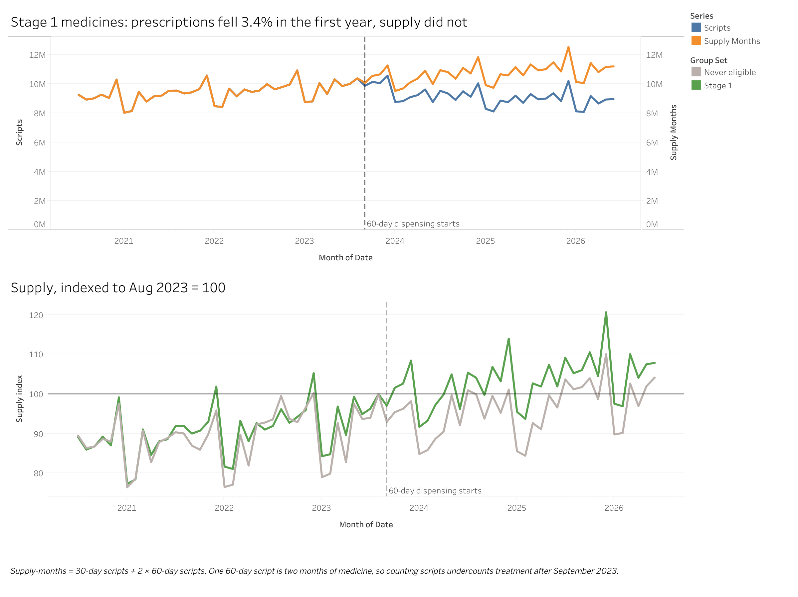
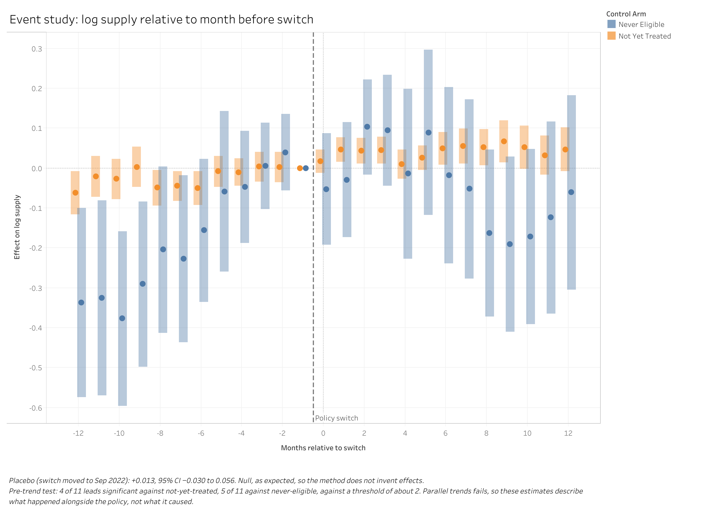

# Did 60-day dispensing cut treatment, or just cut prescriptions?


From September 2023 Australia let common medicines be dispensed two months at a time,
rolled out in three stages. Prescription counts for those medicines fell, and anyone
reading them would conclude patients were getting less treatment. Counted as months of
medicine instead, supply did not fall. In the difference-in-differences model, scripts
dropped 9.5% against medicines that had not yet switched, while supply came in at +3.7%
(95% CI -1.5% to +9.2%).

The parallel trends test fails, so these numbers describe what moved alongside the policy.
They do not prove the policy caused it.

[](https://public.tableau.com/app/profile/eddie.yung2457/viz/PBS60-daydispensingprescriptionsvssupply)

**[Open the interactive dashboard on Tableau Public](https://public.tableau.com/app/profile/eddie.yung2457/viz/PBS60-daydispensingprescriptionsvssupply)**

## The trap in the data

A 60-day script is one dispensing event that covers two months. Suppose a medicine had 100
scripts a month before the policy. Afterwards, 70 patients stay on 30-day scripts and 30
patients move to 60-day scripts, which needs only 15 scripts a month. The count falls from
100 to 85, a 15% drop, and the amount of medicine is exactly the same.

So this project never analyses counts on their own. Every model uses

```
supply_months = scripts_30 + 2.0 * scripts_60
```

with the multiplier fixed in `src/config.py`.

The second trap is finding which medicines were treated. The government's item list for
the policy now returns a 404. Every eligible medicine did get a new PBS item code for the
60-day quantity, though, and that code has no dispensing before its stage month. The
pipeline derives treatment status from those first appearances alone, then checks the
result against numbers it never used (see "Three checks" below).

## Results

Community pharmacy, concessional and general patients, July 2020 to June 2026. The naive
row and the never-eligible row cover Stage 1. The other model rows pool all three stages.
Full reasoning is in [`findings.md`](findings.md).

| Question | Estimate | 95% CI | Source |
|---|---|---|---|
| Stage 1 scripts, 12 months before vs after (no control group) | -3.4% | n/a | `estimates_naive.csv` |
| Scripts, against not-yet-treated medicines | -9.5% | -13.7% to -5.0% | `estimates_primary.csv` |
| Supply, against not-yet-treated medicines | +3.7% | -1.5% to +9.2% | `estimates_primary.csv` |
| Supply, against matched never-eligible medicines | -16.3% | -31.4% to +2.1% | `estimates_primary.csv` |
| Supply, Sun-Abraham cross-check | +4.2% | +2.3% to +6.0% | `estimates_primary.csv` |
| Patient cost per month of therapy, general | -$3.32 | -$3.50 to -$3.14 | `estimates_cost.csv` |
| Patient cost per month of therapy, concessional | -$0.53 | -$0.58 to -$0.47 | `estimates_cost.csv` |

Notes on the table:

- The naive -3.4% is small because uptake was slow. Only 2.0% of Stage 1 dispensing used a
  60-day code in September 2023, rising to 11.1% by March 2024 and 25.0% by June 2026.
- In both control arms supply falls 14 to 16 log points less than scripts do. That gap is
  arithmetic on the same dispensing events, so it survives the failed pre-trend test.
- The two control arms disagree on the level of supply, by 2.05 standard errors. Neither is
  presented as the answer.
- General patients saved about six times more in dollars. As a share of what each group
  was paying before the switch, the savings were close: about 11% for concessional patients
  and 13% for general patients.
- The government-cost estimate is left out of this table on purpose. It is an unweighted
  average dominated by specialty medicines and is larger than the treated groups' own
  baseline cost, so it cannot be read as a budget saving. `findings.md` Q3 has the detail.

## Three checks, fixed before the results

Each check had a pass condition written into the plan before any output existed.

| Check | Pass condition | Result |
|---|---|---|
| Derivation anchor | Derived Stage 1 counts land inside bands around the published 256 items and 92 medicines | **Pass.** 249 new item codes (band 230 to 280) and 91 medicines (band 85 to 100) |
| Parallel trends | No more than about 2 of the 11 pre-period event-study leads individually significant | **Fail.** 4 of 11 against not-yet-treated, 5 of 11 against never-eligible |
| Placebo | Moving the switch to September 2022 gives a null | **Pass.** +0.013 log points (-0.030 to +0.056) |

The anchor bands were never widened after the counts came in. When the parallel trends
check failed, the headline was reframed as descriptive and the event study stayed in the
report. Treated medicines were already catching up with their controls in the year before
the switch, and a before-and-after design reads that catch-up as a policy effect.



Changing the supply multiplier to 1.8 or 1.9 moves the supply estimate to +0.011 or
+0.024 log points. All three versions include zero, so the conclusion does not rest on the
exact multiplier.

## Method

Rollout came in three stages (September 2023, March 2024, September 2024). With staggered
timing, plain two-way fixed effects lets already-treated medicines act as controls for
later ones. The primary estimator is Callaway-Sant'Anna (`did::att_gt`), cross-checked with
Sun-Abraham (`fixest::sunab`).

The unit of analysis is the drug-form group: drug name plus form and strength, which a
60-day item shares exactly with its 30-day sibling. The cohort has 2,749 groups: 244 in
Stage 1, 213 in Stage 2, 227 in Stage 3 and 2,065 never eligible. Two control arms are
estimated side by side:

- Arm A compares each stage with every medicine not yet treated at that point, meaning
  later stages and never-eligible medicines (2,392 groups with panel data).
- Arm B compares Stage 1 with 199 never-eligible medicines matched on ATC class and
  pre-period volume (443 groups).

The PBS safety net resets every January, and total government cost falls 21 to 33% from
December to January in treated and control medicines alike. Callaway-Sant'Anna compares
treated and control medicines in the same calendar month, so that shock differences out.
The Sun-Abraham model adds calendar-month fixed effects explicitly.

```
PBS CSVs -> DuckDB -> cohort derivation -> panel.parquet -> R estimation -> Tableau
```

Python builds everything up to the panel. R does the estimation. The two halves meet at one
Parquet file, so either can be run and reviewed on its own.

## Running it

The processed Parquet files in `data/processed/` are committed as a snapshot of one pipeline
run, so the R analysis runs on a fresh clone without the 196 MB download.

Python 3.13 and R 4.5:

```bash
python -m venv venv && source venv/bin/activate
pip install -r requirements.txt
Rscript -e 'install.packages(c("arrow", "did", "dplyr", "fixest", "ggplot2", "purrr", "readr"))'
```

Rebuild the data from source (optional):

```bash
python -m src.download        # fetch the PBS CSVs into data/raw (cached)
python -m src.load            # load them into DuckDB
python -m src.build_cohort    # derive the cohort; exits 1 if the anchor check fails
python -m src.panel           # write data/processed/panel.parquet
python -m src.controls        # match never-eligible controls
python -m src.checks          # print the diagnostics behind checks_findings.md
python -m src.export          # write the Tableau CSVs
```

Run the analysis, in this order:

```bash
Rscript analysis/01_naive.R          # the before-and-after number, no control group
Rscript analysis/02_did.R            # Callaway-Sant'Anna and Sun-Abraham
Rscript analysis/03_event_study.R    # pre-trend test
Rscript analysis/04_cost.R           # cost by patient type, plus baselines
Rscript analysis/05_robustness.R     # placebo and multiplier sensitivity
```

Tests:

```bash
pytest -v -m "not integration"   # unit tests, no data needed
pytest -m integration -v         # needs data/raw and the built Parquet files
```

## Repository structure

```
.
├── src/                     Python pipeline: raw CSVs -> DuckDB -> Parquet
│   ├── config.py            paths, PBS URLs, stage months, supply multiplier, anchor bands
│   ├── download.py          cached fetch of the PBS Date of Supply CSVs
│   ├── load.py              build data/pbs.duckdb
│   ├── derive.py            stage of each drug-form group, from new item codes
│   ├── guards.py            flag groups the stage rule may misclassify
│   ├── anchor.py            compare derived Stage 1 counts with the published 92 / 256
│   ├── build_cohort.py      derivation, guards and anchor; writes cohort.parquet
│   ├── panel.py             monthly panel by group, patient type and script type
│   ├── controls.py          match never-eligible controls to Stage 1 groups
│   ├── checks.py            diagnostics reported in checks_findings.md
│   └── export.py            CSVs for the Tableau dashboard
├── analysis/                R estimation, 00_prep.R to 05_robustness.R
├── tests/                   pytest suite, unit and integration
├── data/
│   ├── raw/                 source CSVs, gitignored
│   └── processed/           committed snapshot: cohort, panel, matched controls, dashboard CSVs
├── reports/                 estimate CSVs and figures written by the R scripts
├── images/                  dashboard screenshots
├── tableau/                 Tableau Public workbook (.twbx)
├── findings.md              results and recommendations in plain language
├── checks_findings.md       download record, derivation checks, known data limits
└── requirements.txt
```

## Limitations

- Dispensing is not consumption. A medicine collected is not necessarily a medicine taken.
- `supply_months` rests on the assumption that a 60-day script is two months of medicine.
- There is no patient-level data, so nothing can be said about individual adherence,
  switching or discontinuation.
- The dataset has no geographic field.
- Parallel trends was tested and failed. No estimate here carries a causal reading.
- Arm B overlap is thin in cardiovascular medicines, where Stage 1 is concentrated. Part of
  that comparison rests on two anti-arrhythmics (see `checks_findings.md`).
- The 2025-26 financial year file is the latest, and its trailing months may revise as late
  claims are processed.

## Related work

UNSW's Centre of Research Excellence in Medicines Intelligence runs a
[60 Day Prescribing program](https://www.unsw.edu.au/medicine-health/our-schools/population-health/research/centre-research-excellence-medicines-intelligence/60DD).
It uses patient-level data, the PBS 10% sample and the ABS Person Level Integrated Data
Asset (PLIDA), to study uptake, patient characteristics and adherence. This project uses
only public aggregate data and asks a narrower question at the medicine level: whether
supply changed once counts are corrected for the longer scripts. The two are complementary.

## Data

PBS Date of Supply statistics, from
`https://www.pbs.gov.au/statistics/dos-and-dop/files/`:

- `dos-jul-2020-to-jun-2021-phrmcy-type.csv` through `dos-jul-2025-to-jun-2026-phrmcy-type.csv`
  (six financial years)
- `pbs-item-drug-map.csv`

Filters: community pharmacy (`PHRMCY_TYPE = 'S90'`) and patient categories `C0`, `C1`
(concessional) and `G1`, `G2` (general). The files are Latin-1 encoded, and a UTF-8 read
fails on accented drug names. PBS revises historical files without renaming them, so
`checks_findings.md` records the byte size and retrieval date of every file used.
